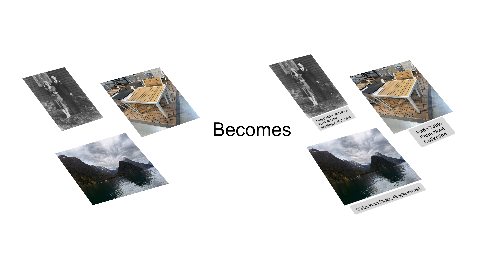

# PhotoCaption
PhotoCaption is a tool to add captions to the bottom of photo images.  This is useful for a variety of reasons but was mainly created to solve the problem of labeling genealogy photos.  This tool will leave the original photo intact and only append to the bottom of the photo the information you provide.

## Platforms
A build for both macOS and Windows is available.  Currently, it only supports JPEG and PNG images.

## Use Cases

### Personal & Family
- **Genealogy** — identify people, places, and dates in old family photos before the details are lost forever
- **Travel** — label locations and landmarks while the memories are still fresh
- **Milestones** — school photos, graduations, anniversaries with names, years, and context
- **Before & After** — home renovations, gardens, or other projects that benefit from a labeled record

### Professional & Creative
- **Copyright** — embed your name and copyright notice directly into the image
- **Real estate** — label rooms and features for property listings
- **Product photography** — annotate SKUs, model names, or dimensions for catalogs
- **Journalism** — photo captions are a standard requirement for press and editorial work
- **Scientific / medical** — label specimens, slides, or field observations

### Community & Events
- **Sports teams** — identify players in group photos
- **Church or club directories** — name members in group shots
- **Event photography** — speakers, award recipients, key moments

### Legal & Administrative
- **Insurance documentation** — describe damaged items with date and context
- **Contractor work logs** — photo plus description of work completed
- **Inventory tracking** — label equipment, serial numbers, and condition

## Acknowledgements
Built with the assistance of [Claude](https://claude.ai) by Anthropic.

## Disclaimer
This software is provided "as is", without warranty of any kind. The author is not liable for any damages or data loss arising from the use of this software. Use at your own risk.

## License
This project is licensed under the [GNU Affero General Public License v3.0 (AGPL-3.0)](LICENSE).

You are free to use, copy, and modify this software provided that:
- You give appropriate credit to the original author.
- Any derivative works are distributed under the same license.
- The software is not used for commercial or monetary benefit.

## Future Enhancements
* Support other image formats. Possibly tiff, bmp, gif and more.
* Allow to easily use the caption text as the file name.
* Add a file list in the window pane to navigate from file to file.
* Allow the user to use a different font of their choosing.
